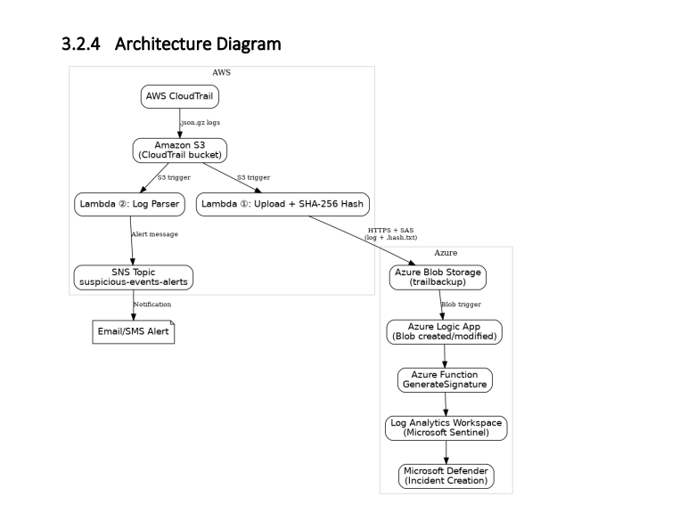
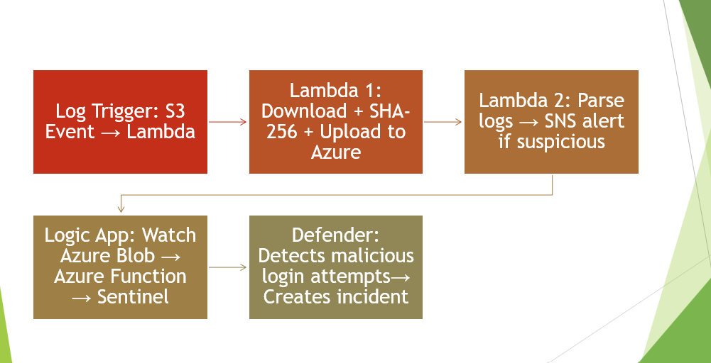

**# multi-cloud-forensic-readiness-pipeline**
Serverless multi-cloud forensic readiness framework using AWS CloudTrail, Azure Blob Storage, Microsoft Sentinel, and Defender.

---

## 📖 Overview

This project implements a fully serverless, multi-cloud security architecture designed to enhance forensic readiness through:

- Cross-cloud log redundancy
- SHA-256 integrity verification
- Real-time suspicious activity detection
- Microsoft Sentinel SIEM integration
- Automated incident creation via Microsoft Defender

---

## 🏗️ Architecture

AWS CloudTrail → Amazon S3 → AWS Lambda (Upload + Hash)  
→ Azure Blob Storage → Azure Logic App → Azure Function  
→ Microsoft Sentinel → Microsoft Defender Incident

---

## 🔐 Security Features

### Cross-Cloud Redundancy
CloudTrail logs are replicated from AWS to Azure.

### Integrity Assurance
Each log file is hashed using SHA-256.
A `.hash.txt` file is stored alongside the log.

### Real-Time Alerting
Suspicious API calls such as:
- DeleteTrail
- StopLogging
- Root login without MFA

Trigger:
- AWS SNS Email Alerts
- Microsoft Defender Incident Creation

---

## 📊 Results

- Detection latency < 3 seconds (AWS)
- Sentinel ingestion < 10 seconds
- 0 false positives in controlled testing
- Fully serverless architecture
- No third-party agents required

---

---

## ⚙️ Technologies Used

- AWS CloudTrail
- AWS Lambda
- Amazon S3
- AWS SNS
- Azure Blob Storage
- Azure Logic Apps
- Azure Functions
- Microsoft Sentinel
- Microsoft Defender
- Kusto Query Language (KQL)

---

---

## 📈 Future Improvements

- ML-based anomaly detection
- Periodic hash revalidation
- Blockchain anchoring for high-value logs
- SOAR integration

---

## 📜 License

MIT License
